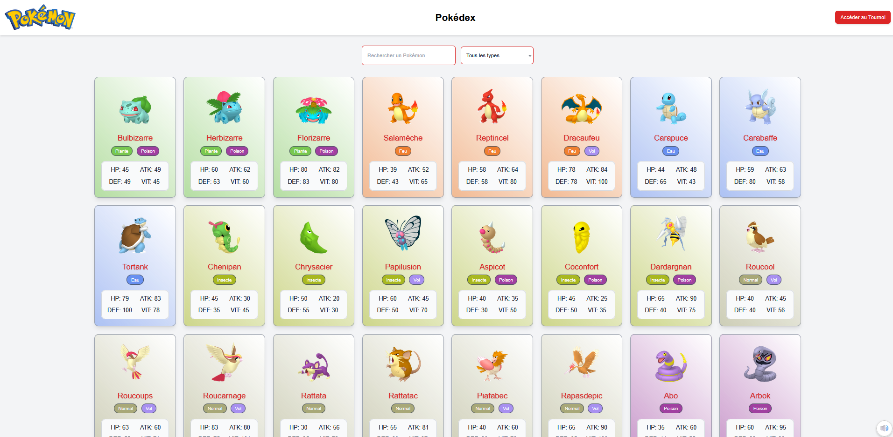
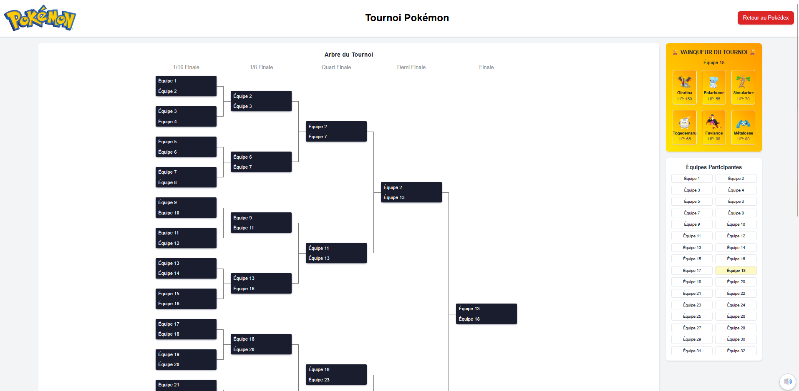
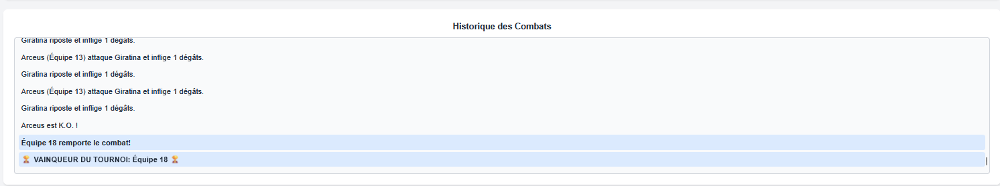

# Pokémon Tournament

Ce projet est une application Next.js qui combine un **Pokédex** et un **Tournoi Pokémon**.

Les trois fonctionnalités principales sont :

- **Pokédex** : 
  - Affichage d'une liste de Pokémon avec recherche et filtrage par type.
  - Chaque carte affiche l'image du Pokémon, ses statistiques (HP, ATK, DEF, VIT) et ses types (affichés avec des dégradés).

- **Tournoi Pokémon** : 
  - Génération automatique de 32 équipes composées de 6 Pokémon chacune.
  - Simulation d'un tournoi en élimination directe avec combats 1 contre 1.
  - Calcul des dégâts, coups critiques et contre-attaques.
  - Affichage graphique d'un arbre du tournoi avec un historique détaillé des combats.
  - Affichage du vainqueur du tournoi avec ses Pokémon présentés dans un conteneur au dégradé CSS personnalisé.
  - Enregistrement des données de combat dans la collection MongoDB `battles`.
 
- **Lecteur de musique**
    - Lecteur dépliable en bas à droite de l'écran avec le logo haut parleur.
    - 50 musiques des jeux pokémons joués aléatoirement.
    - Système pour Recommencer la musique, Lancer la précédente, Lancer la suivante, Faire Pause / Play, Couper le son.
    - Lecteur persistant sur les deux pages, donc pas de coupure au changement de page.

##  Prérequis :
- [Docker](https://www.docker.com/), [Docker Compose](https://docs.docker.com/compose/) et [MongoDBCompass](https://www.mongodb.com/products/tools/compass) installés sur votre machine.

## Installation et Exécution :

1) **Cloner le projet**
    ```bash
   git clone https://github.com/SirKingg/TD_Pokemon_NoSQL.git
   cd TD_Pokemon_NoSQL/pokemon-tournament
    ```

2) **Configurer l'environnement** :

   Créer un fichier .env.local à la racine du projet :
    ```bash
   echo. > .env.local
    ```
   Et y définir la variable de connexion MongoDB, par exemple :
   ```env
   MONGO_URI=mongodb://db:27017/pokemon
   ```
   Dans le fichier `TD_Pokemon_NoSQL/data/mongo-init.sh` vérifier que les fins de lignes soit bien en LF et non en CRLF


3) **Lancer Docker puis lancer l'application avec Docker Compose depuis le repertoire "TD_Pokemon_NoSQL"**

   ```bash
   docker-compose up --build -d
   ```

   **Cette commande va** :

    - Construire l'image de l'application Next.js depuis le Dockerfile (dans le dossier pokemon-tournament).

    - Démarrer un conteneur MongoDB qui crée automatiquement les collections dans la base de données pokemon.

    - Démarrer l'application sur le port 3000 et MongoDB sur le port 27018.
      
    - S'assurer que la base de données est opérationnelle (via healthcheck) avant de lancer l'application.
    
4) **Importer les données dans la base MongoDB Compass** :

   Depuis MongoDB Compass importer le fichier pokemon.json `TD_Pokemon_NoSQL/data/pokemon.json` dans base de données pokemon dans la collection pokedex.
   
5) **Accéder à l'application** :

   Ouvrir http://localhost:3000 dans un navigateur.

## Structure du Projet :
- **components/** : Composants React réutilisables (par exemple, `MusicPlayer`).
- **lib/** : Fichiers utilitaires (par exemple, `dbConnect.ts` pour la connexion à MongoDB).
- **models/** : Schémas Mongoose pour MongoDB (Battle, Pokemon, Team).
- **pages/** :
    - **api/** : Routes API (pour le pokédex, les équipes, les battles, etc.).
    - **index.tsx** : La page du Pokédex.
    - **tournament.tsx** : La page du tournoi Pokémon.
    - **_app.tsx** et **_document.tsx** : Fichiers de configuration Next.js.
- **public/** : Fichiers statiques, y compris le logo, icônes et musiques.
- **styles/** : Feuilles de style globales et configuration de Tailwind CSS.

## Docker Compose :
Le fichier `docker-compose.yml` définit deux services :
- **db** :
    - Utilise l'image `mongo:latest`.
    - Monte le fichier `./data/pokemon.json` dans `/docker-entrypoint-initdb.d/pokemon.json` pour l'import automatique des données.
    - Expose le port 27017.
    - Dispose d'une healthcheck qui s'assure que MongoDB répond à la commande `db.adminCommand('ping')`.

- **app** :
    - Construit l'application Next.js à partir du Dockerfile situé dans le dossier `pokemon-tournament`.
    - Expose le port 3000.
    - Dépend du service `db` (condition `service_healthy`) pour s'assurer que la base de données est prête avant de démarrer l'application.


## Screenshots




## Auteurs :
**Thibaut Jacquemin & Brice Volpi**
